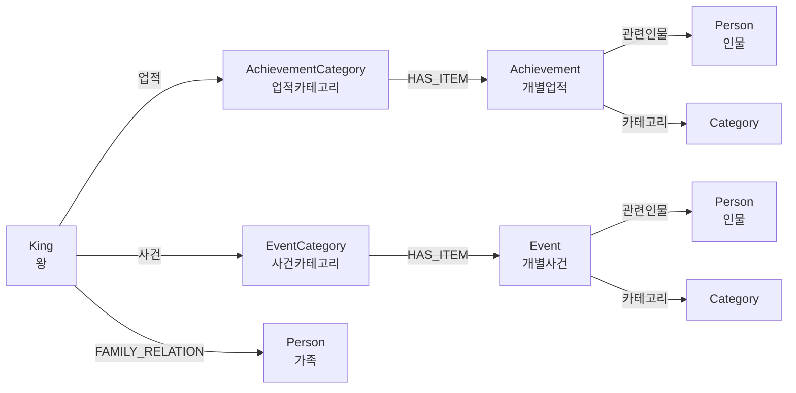

# 조선왕조 역사 그래프 추출 시스템 V2

왕 중심의 계층적 지식 그래프를 자동으로 구축하는 시스템입니다.

## 🎯 주요 특징

- **왕 중심 계층 구조**: 왕 → 업적/사건 → 카테고리 → 개별 항목 → 관련인물
- **자동 엔티티 추출**: Ollama LLM을 사용한 자동 정보 추출
- **인물 중복 제거**: 동일 인물은 하나의 노드로 통합
- **의미 기반 검색**: 한국어 임베딩을 통한 벡터 검색
- **27명 조선 왕 지원**: 태조부터 순종까지 전체 왕조 커버

## 📊 그래프 스키마



### 노드 타입

- **King**: 조선 왕 (27명)
- **Person**: 역사 인물 (가족, 신하, 관련 인물)
- **AchievementCategory**: 업적 카테고리 (정치, 군사, 문화 등)
- **Achievement**: 개별 업적 (텍스트 내용 포함)
- **EventCategory**: 사건 카테고리 (왕실, 국내, 국외 등)
- **Event**: 개별 사건 (텍스트 내용 포함)
- **Category**: 범용 카테고리 노드

### 관계 타입

- **업적**: King → AchievementCategory
- **사건**: King → EventCategory
- **HAS_ITEM**: Category → Achievement/Event
- **관련인물**: Achievement/Event → Person
- **FAMILY_RELATION**: King → Person (가족, type 속성으로 관계 구분)
- **카테고리**: Achievement/Event → Category

## 🚀 설치 및 설정

### 1. 필수 프로그램

- **Python 3.8+**
- **Neo4j 5.x** (로컬 또는 원격)
- **Ollama** (exaone3.5:7.8b 모델)

### 2. Python 패키지 설치

```bash
pip install neo4j sentence-transformers torch python-dotenv tqdm requests
```

### 3. 환경 변수 설정 (.env)

`.env` 파일을 프로젝트 루트에 생성:

```env
# Neo4j 설정
NEO4J_URI=bolt://127.0.0.1:7687
NEO4J_USERNAME=neo4j
NEO4J_PASSWORD=qqqqqqqq
NEO4J_DATABASE=neo4j

# Ollama 설정
OLLAMA_BASE_URL=http://localhost:11434
OLLAMA_MODEL=exaone3.5:7.8b

# 임베딩 모델
EMBEDDING_MODEL=jhgan/ko-sroberta-multitask
```

### 4. Ollama 모델 다운로드

```bash
ollama pull exaone3.5:7.8b
```

## 📝 사용법

### 전체 프로세스 (권장)

```bash
# 1. 데이터베이스 초기화 (기존 데이터 삭제)
python setup_database.py --clear

# 2. newInput 폴더의 모든 파일 처리 (임베딩 포함)
python batch_extract_newInput.py

# 3. 그래프 검증
python verify_graph.py
```

### 단계별 실행

#### 1단계: DB 초기화

```bash
# 데이터 삭제 없이 인덱스만 생성
python setup_database.py

# 모든 데이터 삭제 후 초기화
python setup_database.py --clear
```

#### 2단계: 배치 처리

```bash
# 전체 27개 파일 처리
python batch_extract_newInput.py

# 임베딩 생성 건너뛰기 (빠른 테스트)
python batch_extract_newInput.py --skip-embeddings

# 처음 3개 파일만 처리 (테스트용)
python batch_extract_newInput.py --limit 3
```

#### 3단계: 검증

```bash
python verify_graph.py
```

### 개별 파일 테스트

```bash
# 텍스트 파싱 테스트
python text_parser.py newInput/1.태조.txt

# 엔티티 추출 테스트
python entity_extractor.py newInput/1.태조.txt

# 그래프 구축 테스트
python graph_builder_v2.py newInput/1.태조.txt

# 임베딩 생성
python embedding_generator.py
```

## 🔍 Neo4j 쿼리 예시

### 기본 조회

```cypher
// 모든 왕 목록
MATCH (k:King)
RETURN k.name, k.reign_start, k.reign_end
ORDER BY k.reign_start

// 특정 왕의 전체 그래프 (3홉)
MATCH p=(k:King {name:'세종'})-[*1..3]-()
RETURN p LIMIT 100

// 왕의 업적만 조회
MATCH (k:King {name:'태조'})-[:업적]->(ac:AchievementCategory)
      -[:HAS_ITEM]->(a:Achievement)
RETURN ac.category, a.title, a.description
```

### 업적 및 사건 검색

```cypher
// 정치 관련 업적 찾기
MATCH (a:Achievement)-[:카테고리]->(c:Category {name:'정치'})
RETURN a.king, a.title, a.description

// 특정 연도의 사건
MATCH (e:Event)
WHERE e.year = 1592
RETURN e.title, e.description, e.king

// 특정 카테고리의 모든 업적
MATCH (ac:AchievementCategory {category:'문화'})-[:HAS_ITEM]->(a:Achievement)
RETURN a.king, a.title
```

### 인물 관련 쿼리

```cypher
// 특정 인물이 관련된 모든 업적/사건
MATCH (p:Person {name:'정도전'})<-[:관련인물]-(item)
WHERE item:Achievement OR item:Event
RETURN labels(item), item.title, item.king

// 가장 많이 등장하는 인물 Top 10
MATCH (p:Person)<-[:관련인물]-(item)
WITH p, count(item) as connections
RETURN p.name, connections
ORDER BY connections DESC
LIMIT 10

// 왕의 가족관계
MATCH (k:King {name:'태조'})-[r:FAMILY_RELATION]->(p)
RETURN r.type, p.name, r.detail
```

### 계층 구조 탐색

```cypher
// 업적 계층 구조 (왕 → 카테고리 → 항목 → 인물)
MATCH path=(k:King)-[:업적]->(ac:AchievementCategory)
           -[:HAS_ITEM]->(a:Achievement)-[:관련인물]->(p:Person)
WHERE k.name = '세종'
RETURN path

// 사건 계층 구조
MATCH path=(k:King)-[:사건]->(ec:EventCategory)
           -[:HAS_ITEM]->(e:Event)-[:관련인물]->(p:Person)
WHERE k.name = '선조'
RETURN path
```

### 벡터 검색 (임베딩 활용)

```cypher
// 가장 유사한 업적 찾기 (벡터 검색)
// 주의: $query_vector는 Python에서 임베딩 생성 후 전달
CALL db.index.vector.queryNodes('achievement_embedding', 10, $query_vector)
YIELD node, score
RETURN node.title, node.description, score
ORDER BY score DESC
```

## 📁 프로젝트 구조

```
joseon_graphrag/
├── config.py                    # 설정 파일
├── schema_config.py             # 그래프 스키마 정의
├── text_parser.py               # 텍스트 파일 파싱
├── entity_extractor.py          # LLM 엔티티 추출
├── person_manager.py            # 인물 정규화 관리
├── graph_builder_v2.py          # Neo4j 그래프 구축
├── embedding_generator.py       # 임베딩 생성
├── setup_database.py            # DB 초기화 및 인덱스 생성
├── batch_extract_newInput.py    # 배치 처리
├── verify_graph.py              # 그래프 검증
├── newInput/                    # 입력 텍스트 파일
│   ├── 1.태조.txt
│   ├── 2.정종.txt
│   └── ...
└── .env                         # 환경 변수
```

## 🔧 커스터마이징

### 카테고리 추가

[schema_config.py](schema_config.py)에서 업적/사건 카테고리 수정:

```python
ACHIEVEMENT_CATEGORIES = [
    "정치", "군사", "경제", "사회", "문화", 
    "과학", "건축", "법률", "외교", "교육"
]
```

### LLM 모델 변경

`.env` 파일에서 모델 변경:

```env
OLLAMA_MODEL=llama3.1:13b
```

### 임베딩 모델 변경

```env
EMBEDDING_MODEL=BM-K/KoSimCSE-roberta
```

## 🐛 트러블슈팅

### Neo4j 연결 실패

```bash
# Neo4j 상태 확인
neo4j status

# Neo4j 시작
neo4j start
```

### Ollama 연결 실패

```bash
# Ollama 서비스 확인
ollama list

# Ollama 서비스 재시작
# Windows: Ollama 앱 재시작
# Linux/Mac: systemctl restart ollama
```

### 메모리 부족

배치 크기 줄이기 ([config.py](config.py)):

```python
EMBEDDING_BATCH_SIZE = 25  # 기본값 50에서 감소
```

## 📊 성능

- **처리 속도**: 파일당 약 2-5분 (LLM 속도에 따라 다름)
- **전체 27개 파일**: 약 1-2시간
- **그래프 크기**: 
  - 노드: 약 2,000-5,000개
  - 관계: 약 5,000-15,000개

## 📚 참고

- [Neo4j Documentation](https://neo4j.com/docs/)
- [Ollama Documentation](https://github.com/ollama/ollama)
- [SentenceTransformers](https://www.sbert.net/)

## 📄 라이선스

이 프로젝트는 교육 및 연구 목적으로 제작되었습니다.
